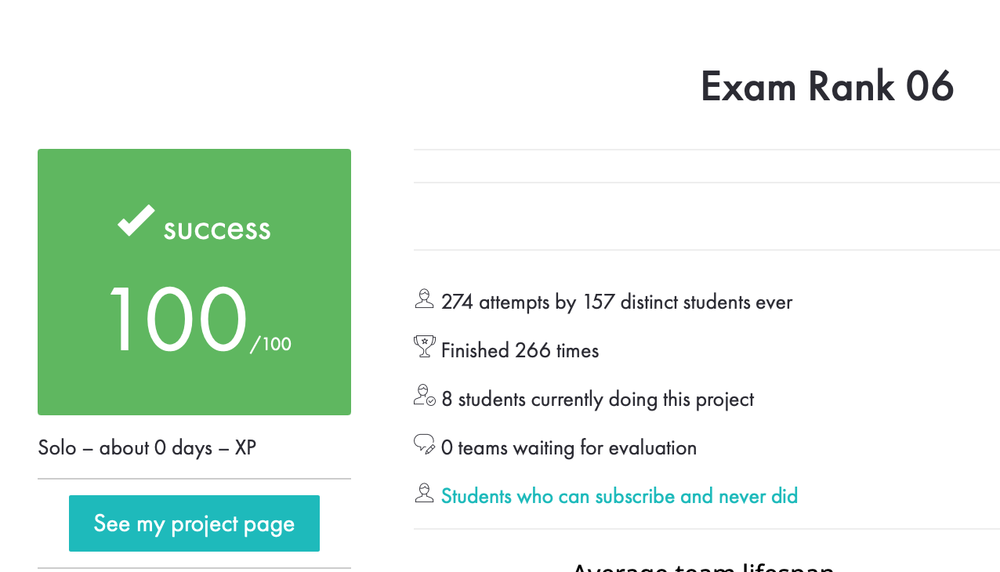

## Exam06 – Mini-serveur TCP


---

## Objectif de l’examen

Le but de l’exam06 est d’implémenter un petit serveur TCP capable de :
- accepter plusieurs clients en même temps grâce à select(2),
- gérer les connexions/déconnexions en temps réel,
- assembler les messages reçus par chaque client jusqu’au caractère \n,
- diffuser chaque ligne complète à tous les autres clients (“broadcast”),
- annoncer l’arrivée et le départ des clients.
- Le tout dans un seul fichier C, sans dépendances externes.

---
## Compilation & lancement

Terminal 1:
```
cc -Wall -Wextra -Werror mini_serv.c -o mini_serv
./mini_serv 4242
```
Le serveur écoute en local sur 127.0.0.1:4242.
Test rapide avec netcat :
Terminal 2:
```
nc 127.0.0.1 4242   # client A
```
Terminal 3:
```
nc 127.0.0.1 4242   # client B
```
Tape une ligne dans A → elle s’affiche chez B (et inversement).

---
## Points clés de l’implémentation
Utilisation de select() pour surveiller lecture/écriture sur les sockets.
Chaque nouveau client reçoit un id incrémental.
Lorsqu’un client envoie une ligne complète, elle est renvoyée au format :
client X: <message>
À la connexion :
server: client X just arrived
À la déconnexion :
server: client X just left

---
## Particularité des tests Grademe
Les scénarios du correcteur changent à chaque run (timing, nombre de clients, séquence d’événements).
Il est normal qu’un test échoue au premier essai.
Si un test échoue, il faut lancer le suivant (test 2, test 3, etc.).
Dans mon cas, le code a validé au 4ᵉ test sans devoir changer le code.

⚠️ Donc ne paniquez pas si tout ne passe pas directement, c’est attendu.
✅ Résultat
L’examen est validé.

Le serveur passe les tests Grademe même si parfois il faut plusieurs runs.
Robustesse et gestion des cas limites (messages coupés, multiples lignes dans un même recv, départs inopinés) sont essentielles.

---
##Notes
L’adresse IP 2130706433 correspond à 127.0.0.1 (localhost).
Les buffers sont volontairement grands pour simplifier la gestion.
Pas d’allocation dynamique → tout est en statique, plus sûr dans un contexte d’examen.
